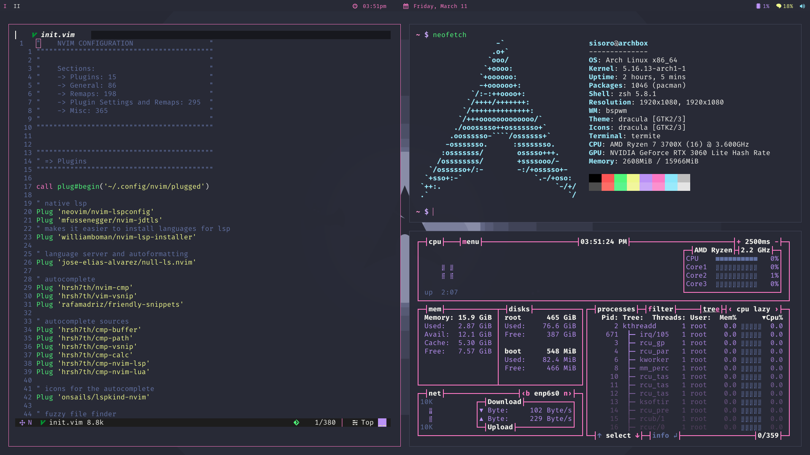

Ryan's Dotfiles

## Preview

  

## Software
These are my arch linux configuration files. Some of the important software in use are:

- [bspwm](https://github.com/baskerville/bspwm) - tiling window manager
- [neovim](https://github.com/neovim/neovim) - text editor
- [polybar](https://github.com/polybar/polybar) - status bar
- [starship](https://starship.rs/) - universal terminal prompt
- [termite](https://github.com/aperezdc/termite) - terminal
- [zathura](https://github.com/pwmt/zathura) - document viewer
- [zsh](https://www.zsh.org/) - shell
